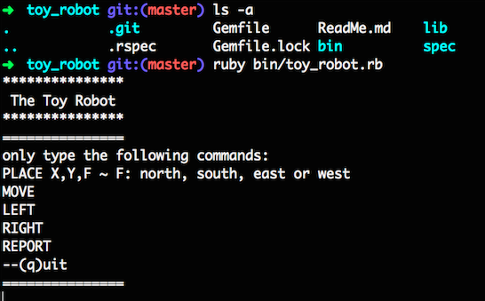
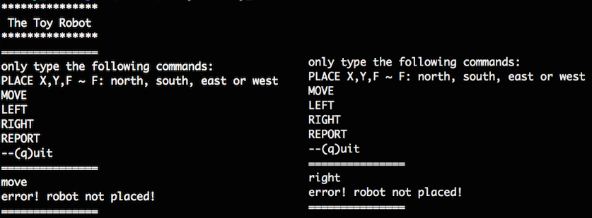
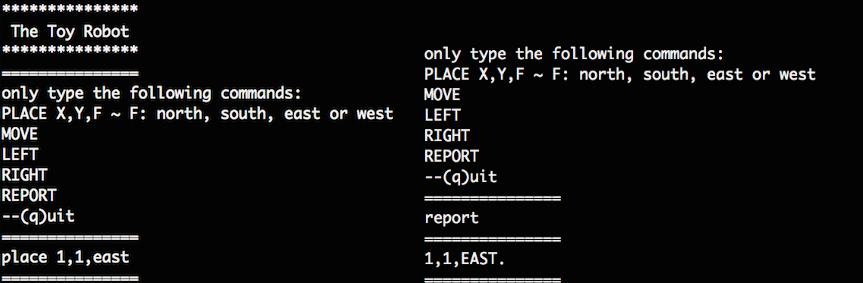
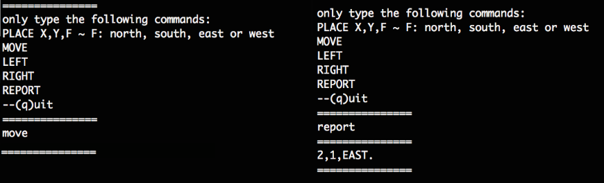
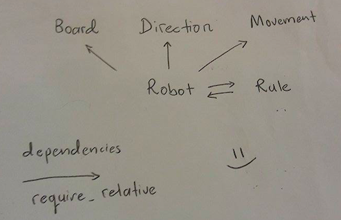

# ReadMe

## Usage

From the root directory, type following in the command line.
```
$ ruby bin/toy_robot.rb
```


If a move, turn or report command is detect prior to a place command, an error output will show up.



Start by placing the robot with the exact syntax. Then a move, turn,report or another place command can follow after.





## Testing
RSpec is implemented for testing code quality. To run tests, run the below command.

```
$ rspec
```

## Specifications
**Description:**

The application is a simulation of a toy robot moving on a square table top, of dimensions 5 units x 5 units. There are no other obstructions on the table surface. The robot is free to roam around the surface of the table, but must be prevented from falling to destruction. Any movement that would result in the robot falling from the table must be prevented, however further valid movement commands must still be allowed.

Create an application that can read in commands of the following form
```
PLACE X,Y,F
MOVE
LEFT
RIGHT
REPORT
```

PLACE will put the toy robot on the table in position X,Y and facing NORTH, SOUTH, EAST or WEST. The origin (0,0) can be considered to be the SOUTH WEST most corner. The first valid command to the robot is a PLACE command, after that, any sequence of commands may be issued, in any order, including another PLACE command. The application should discard all commands in the sequence until a valid PLACE command has been executed. MOVE will move the toy robot one unit forward in the direction it is currently facing. LEFT and RIGHT will rotate the robot 90 degrees in the specified direction without changing the position of the robot. REPORT will announce the X,Y and orientation of the robot. A robot that is not on the table can choose to ignore the MOVE, LEFT, RIGHT and REPORT commands. Provide test data to exercise the application.

**Constraints:**

The toy robot must not fall off the table during movement. This also includes the initial placement of the toy robot. Any move that would cause the robot to fall must be ignored.

Example Input and Output:

```
PLACE 0,0,NORTH
MOVE
REPORT
```
Output: 0,1,NORTH

```
PLACE 0,0,NORTH
LEFT
REPORT
```
Output: 0,0,WEST

```
PLACE 1,2,EAST
MOVE
MOVE
LEFT
MOVE
REPORT
```
Output: 3,3,NORTH

**Deliverables:**

The source files, the test data and any test code.


## Scalability & Isolation OOD
To start off, I asked for tips and advice from some seniors and people with much more coding experience than I do. They all suggested the same thing, "Build it in such a way that it's scaleable".

According to google:
Scalability is the capability of a system, network, or process to handle a growing amount of work, or its potential to be enlarged in order to accommodate that growth.

They suggested isolation of components so that when improvements or other implementations are required, you only need to change one small part of the code without changing the entire system. Hence, I am to build a system that expects change and will still function accordingly when the limitations are extended.

For example, although the challenge only requires a 5 x 5 arena, the system should still work in the future when I am required to change it to a 10 x 10 arena. Similarly, the current required directions (face) are NORTH, EAST, SOUTH and WEST. And in the future, if required so, we can change the system to face 8 directions instead, (i.e. N, NE, E, SE, S, SW, W and NW).

## Classes
located in the /lib folder,



### 1. Board
**Description:** Setting the arena / playing field

**Function:** set_dimensions

**Possible Future Plans/ Scalability:** bigger playing field

### 2. Direction
**Description:** Robot's universal compass

**Functions:**
* initialize - to obtain current direction
* rotate_90_degrees_left - --compass_index of Compass Array
* rotate_90_degrees_right - ++compass_index of Compass Array
* Private function to recognize extended indices (scroll down for explanation)

**Possible Future Plans/ Scalability:**
* turns other than 90 degrees,
* North East/West & South East/West in Compass Array

### 3. Movement
**Description:** Robot's mobility

**Functions:**
* initialize - to obtain current location & direction
* move_forward - move forward based on direction face

**Possible Future Plans/ Scalability:**
* Move backwards, sideways
* Move diagonally +i+j , -i-j, +i-j, -i+j
* Unit Step(s)

### 4. Rule
- **Description:** Game's Rule - Robot's Moral Values

- **Functions:**
  * check_robot_is_placed
  * check_initial_command - must be place command

- **Possible Future Plans/ Scalability:**
  * Constrains/Specifications change its inevitable
  * 2 robots cannot not be on the same spot at once

### 5. Robot
- **Description:** The essence of life

- **Functions:**
  * move
  * turn_left
  * turn_right
  * report

- **Possible Future Plans/ Scalability:**
  * Multiple robots - different names - initialize(name=default)

### Private Function in Direction

On being practical, instead of building a LARGE if else statement containing what to do when what instructions given. Ive decided that a link list would be appropriate.
The directions are declared in an array and a code that links one end to the other, resulting in an endless loop forward and back, was written.
```
Directions = ["NORTH","EAST","SOUTH","WEST"]
```

When the robot is required to TURN right, all I need to do is increment an index count. Alternately, turning left decrements the index count. That way, the incrementing and decrementing of index allows us to move from one element to another in the Directions array. With the link, incrementing from WEST (array index position 4) should result in NORTH.

Considering the pseudocode below,
```
check for current position (N,E,S,or WEST)
  if command = RIGHT and current position == N,
  rotate right and current position = E
  if command = LEFT and current position == N,
  rotate left and current position = W
  ...
  ..
  .
```


There are 2 possible actions for 4 different directions (8 conditional statements). What happens in the future when we're required to have 8 directions instead of 4. What will we do next? Create all 16 conditional statements? The code will no longer be practical or D.R.Y.

**Personal Approach**
```
Directions = ["NORTH","EAST","SOUTH","WEST"]
```

Turning right or left 4 times takes you into the unknown territory an array. For instance, Directions[-2] => "SOUTH" and Directions[-4] => "NORTH". However, Directions[-5] and Directions[4] on wards give you => nil. These unrecognized extended indices can still represent any of the current 4 elements in the array(actual index).

|Array Elements| "NORTH" | "EAST" | "SOUTH"| "WEST" |
|---|---|---|---|---|
|Unrecognized Extended Index(UEX)| -12 | -11 | -10| -9 |
|Unrecognized Extended Index(UEX)| -8 | -7 | -6| -5 |
|Recognized Actual Index(RAX)| -4 | -3 | -2| -1 |
|Recognized Actual Index(RAX)| 0 | 1 | 2| 3 |
|Unrecognized Extended Index(UEX)| 4 | 5 | 6 | 7 |
|Unrecognized Extended Index(UEX)| 8 | 9 | 10 | 11 |
|Unrecognized Extended Index(UEX)| 12 | 13 | 14| 15 |

I have written down a formula to achieve this.
(pseudocode)

IF index is bigger than the highest recognized actual index ( index > 3),
```
if index > directions.length - 1
  answer = index / directions.length
  extended_key = answer * directions.length
  actual_key = index - extended_key
  index = actual_key
```
ELSE IF index is smaller than the lowest recognized actual index ( index < -4),

```
elsif index < -(directions.length)
  answer = index.abs / directions.length
  extended_key = answer * directions.length
  actual_key = index + extended_key
  index = actual_key
```

**REFACTORED!**

```
numbers_in_between = (index.abs / directions.length) * directions.length

if index > directions.length - 1
  index -= numbers_in_between
elsif index < -(directions.length)
  index += numbers_in_between
end

directions[index]
```


This will now work for both
```
directions = ["N", "NE", "E", "SE", "S", "SW", "W", "NW"],
directions = ["NORTH", "EAST", "SOUTH", "WEST"]
```
